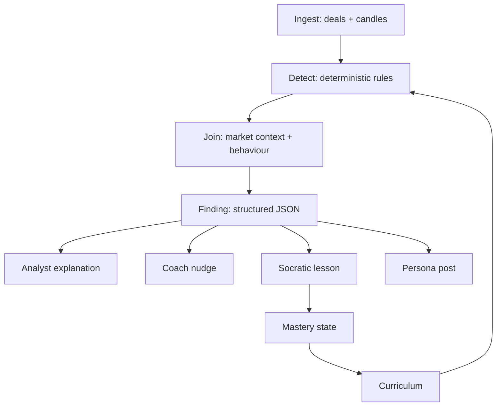

# The Spine

One loop. Five outputs. Everything in [[Feature Index]] is a renderer hanging off the Finding.

## The steps

1. **Ingest** — deal-level trade history plus OHLC candles around every entry and exit. See [[Import Pipeline]].
2. **Detect** — deterministic Java rules over sorted deals. No LLM. See [[Detection Rules]] and [[ADR-001 Deterministic Detection]].
3. **Join** — one LLM call turns detection plus market context into meaning.
4. **Finding** — structured JSON, the single object everything downstream renders from. See [[Finding Generation]].
5. **Mastery** — concept state promoted by later behaviour, not by quiz. See [[Mastery State Machine]].

## Why the Finding is JSON, not prose

Four renderers consume the same object. If step 3 emits prose, every renderer re-parses it and they drift. Structure it once.

## The loop closes

Mastery feeds back into which detections are surfaced first. A concept already solid gets deprioritised; a shaky one gets pushed. That feedback edge is what makes it a curriculum rather than a report.
