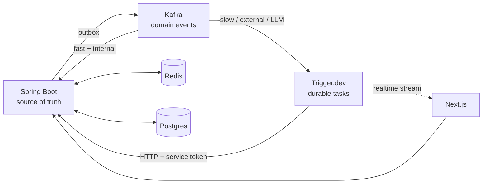

# Stack Overview

| Layer | Choice | Note |
|---|---|---|
| Database | Postgres | [[ERD]] |
| Backend | Spring Boot (Java 21) | [[Spring Boot]] |
| Orchestration | Trigger.dev | [[Trigger Dev]] |
| Events | Kafka | [[Kafka Events]] |
| Cache / limits | Redis | [[Redis]] |
| Frontend | Next.js | [[Next.js Frontend]] |
| Market data | Binance, Dukascopy, yfinance | [[Data Sources]] |
| LLM | Gemini free tier, Groq | swappable behind an interface |

## The boundary that matters

Three components can all look like queues. They are not the same thing.

**Spring Boot owns** schema, deal writes, detection rule execution, mastery state, auth. Source of truth, always.

**Kafka owns** what happened, fanned out to consumers inside Spring.

**Trigger.dev owns** slow, external, or LLM work — triggered *from* a Kafka consumer.

**Redis owns** cache, rate limits, cooldowns, idempotency.

## The rule

If the work is fast and internal, do it in the Kafka consumer. If it is an LLM call, an agent, or an outbound fetch, the consumer fires a Trigger.dev task and returns immediately.

**Never run an LLM call inside a Kafka consumer.** Rebalance timeouts and retry storms.

## The other rule

TypeScript never writes to Postgres. Two writers in two languages against one schema will drift, and detection logic plus mastery state are exactly what must not.
