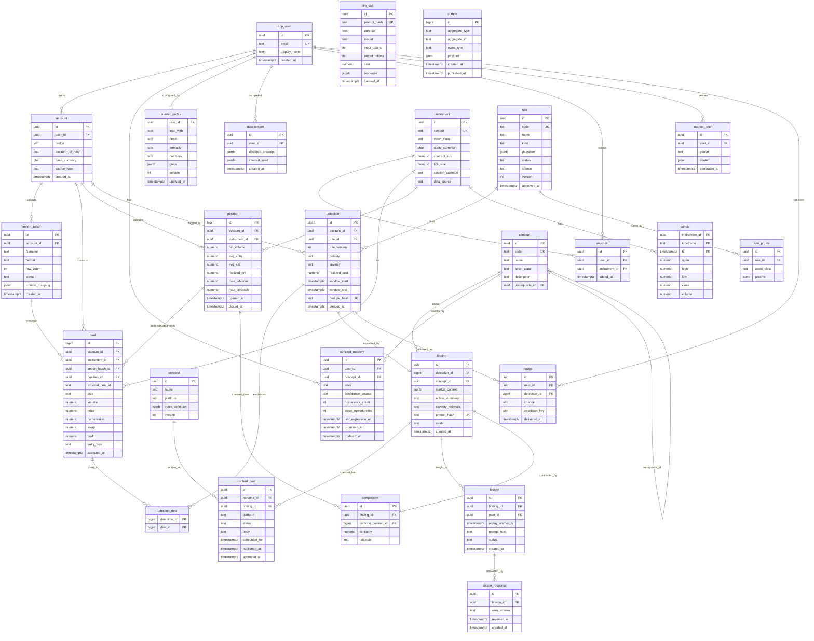

# ERD

Column details and indexing notes in [[Table Reference]].

`llm_call` and `outbox` are infrastructure tables with no foreign keys into the domain — deliberately, so they can be truncated or replayed independently.
