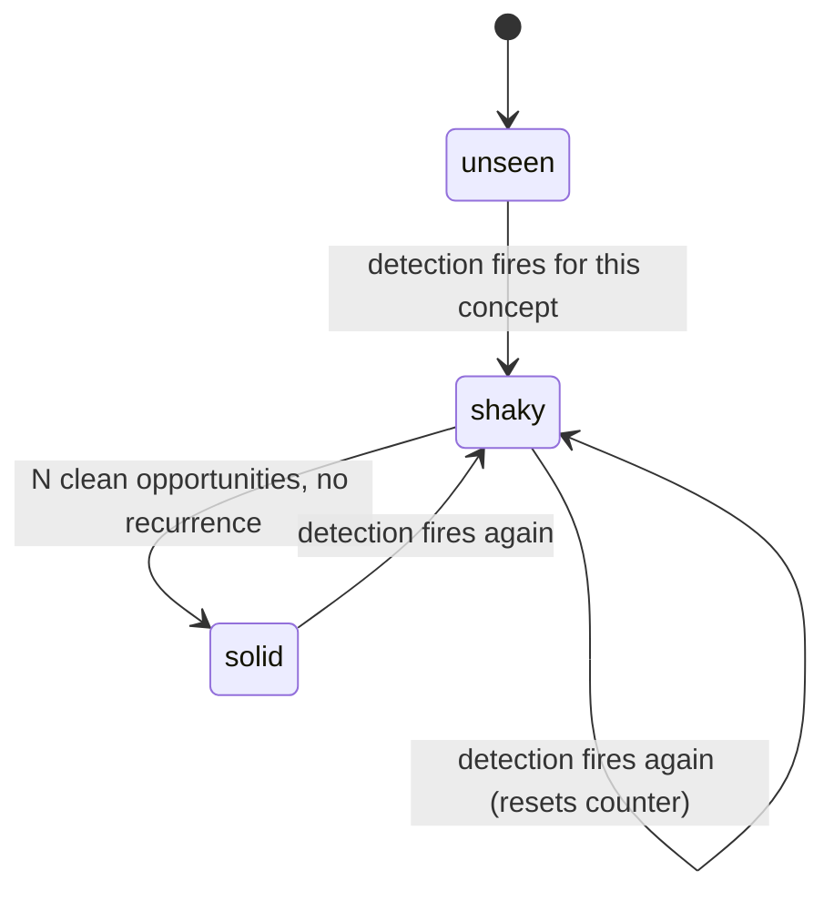

# Mastery State Machine

The answer to "how do you know someone actually learned something?"

Promotion is driven by **later behaviour**, never by a quiz or by the text of a lesson answer.

## Definitions

**Clean opportunity** — a situation matching the rule's preconditions where the rule did *not* fire. A loss followed by no re-entry is a clean opportunity for `REVENGE_SEQUENCE`. Without this concept, a trader who simply stopped trading would be promoted to solid, which is wrong.

**Promotion condition** — `clean_opportunities >= N` since `last_regression_at`, with N defaulting to 3 and configurable per concept.

**Regression** — any new detection for the concept resets `clean_opportunities` to 0 and sets `last_regression_at`.

## Seeding at cold start

A brand-new user has no detections, so every concept sits at `unseen` and the first curriculum is empty. [[Cold-Start Assessment]] seeds an opening position from the imported statement plus a short declared questionnaire.

Seeded states carry `confidence_source = assessed`. They are provisional: the first real detection overrides them, and that override is **not** counted as a regression.

## Why not grade the lesson answer

Grading text measures articulacy, not behaviour. A trader can write a perfect explanation of position sizing and double up after the next loss. The only honest evidence is the next trade.

The lesson answer is stored for the reveal comparison in [[Socratic Replay]] and for nothing else.

## Projection, not truth

`concept_mastery` is derived. Rebuild it by replaying `DetectionCreated` and `LessonCompleted` from [[Kafka Events]]. Expect to rewrite these rules repeatedly — design for replay from the start.

## Curriculum ranking

Shaky concepts ordered by summed `realized_cost` of their detections, filtered by prerequisite ordering from [[Concept Taxonomy]]. It is a debt list, not a syllabus.
